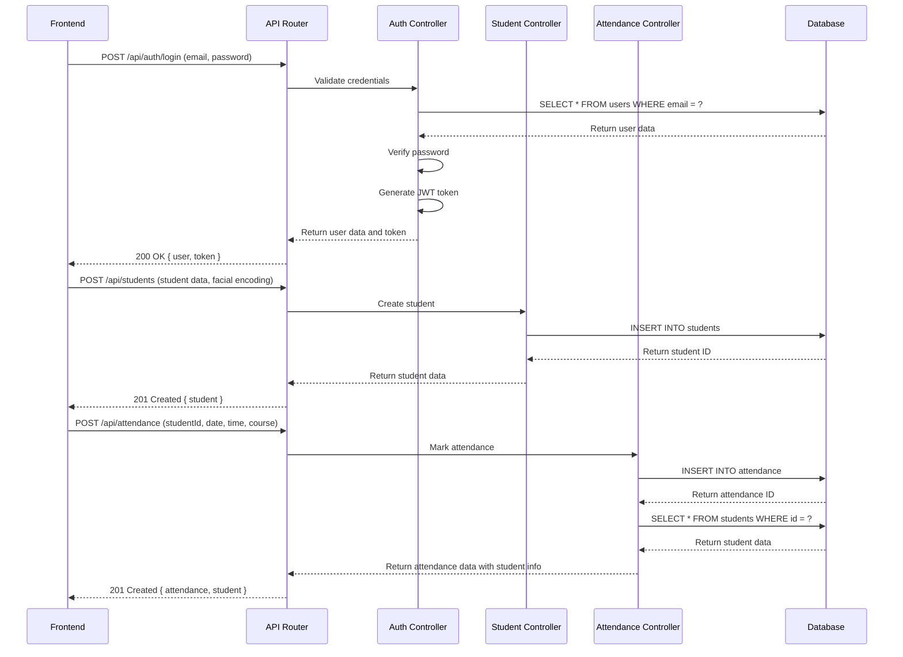

# Software Requirements Specification

## 1. Introduction

### 1.1 Purpose
The Smart Facial Recognition Attendance System (SFRAS) is a web-based application designed to automate the process of marking student attendance using AI-powered facial recognition technology. This system aims to eliminate the inefficiencies of traditional attendance methods, such as manual roll calls, while providing accurate, real-time attendance data and comprehensive reporting capabilities.

### 1.2 Document Conventions
This document follows the IEEE 830-1998 standard for Software Requirements Specifications. The following conventions are used:

- **FR**: Functional Requirement
- **NFR**: Non-Functional Requirement
- **TR**: Technical Requirement
- **EL**: Exclusion/Limitation
- **CO**: Constraint

### 1.3 Intended Audience
This document is intended for:
- **Project Stakeholders**: To understand the system's capabilities and limitations
- **Developers**: To guide implementation of the system
- **Testers**: To develop test cases based on requirements
- **Educational Institutions**: To evaluate the system's suitability for their needs

### 1.4 Project Scope
The SFRAS will be a full-stack web application that automates attendance marking using facial recognition. It will include user authentication, student management, attendance tracking, and reporting features. The system will be designed to work on both desktop and mobile devices, with a focus on ease of use and reliability.

### 1.5 References
- IEEE 830-1998: IEEE Recommended Practice for Software Requirements Specifications
- face-api.js Documentation: https://justadudewhohacks.github.io/face-api.js/docs/index.html
- Express.js Documentation: https://expressjs.com/
- Sequelize Documentation: https://sequelize.org/
- MySQL Documentation: https://dev.mysql.com/doc/

## 2. Overall Description

### 2.1 Product Perspective
The SFRAS is a standalone system that does not require integration with existing student information systems, although it may be extended to support such integrations in the future. The system will be deployed as a web application accessible through standard web browsers.

### 2.2 Product Functions
The SFRAS will provide the following key functions:
- **User Authentication**: Secure login and registration for administrators and lecturers
- **Student Management**: Registration of students with facial data capture
- **Attendance Marking**: Automatic attendance marking using facial recognition
- **Reporting**: Generation and export of attendance reports
- **Dashboard**: Real-time attendance statistics and quick actions

### 2.3 User Classes and Characteristics
| User Class | Characteristics | Access Level |
|------------|----------------|-------------|
| **Admin** | Has full system access, can manage all users and settings | Full access to all features |
| **Lecturer** | Can mark attendance, view reports, and manage students in their courses | Access to attendance and reporting features |
| **Student** | End-user of the system, has no direct login access | No login access, only interacts through facial recognition |

### 2.4 Operating Environment
The SFRAS will operate in the following environment:
- **Frontend**: Web browsers (Chrome, Firefox, Safari, Edge) on desktop and mobile devices
- **Backend**: Node.js server with Express.js framework
- **Database**: MySQL relational database
- **Network**: Internet connection for initial model loading and API calls

### 2.5 Design and Implementation Constraints
- **Technology Stack**: HTML5, CSS3, JavaScript, Node.js, Express.js, MySQL, face-api.js
- **No External Services**: Must use only open-source face-api.js for facial recognition
- **Mobile Compatibility**: Must work on mobile devices with camera access
- **Performance**: Must handle up to 50 students in a single session
- **Security**: Must implement secure authentication and data protection

### 2.6 Assumptions and Dependencies
- **Webcam Access**: Users must have access to a webcam for facial recognition
- **Internet Connection**: Required for initial model loading and API communication
- **Face-api.js Models**: Users must download and install required face-api.js models
- **MySQL Database**: Required for data storage
- **User Consent**: Students must consent to facial data collection for attendance purposes

## 3. Specific Requirements

### 3.1 Functional Requirements

#### 3.1.1 Authentication and Authorization
- **FR1.1.1**: The system shall provide a secure login mechanism for users
- **FR1.1.2**: The system shall support two user roles: Admin and Lecturer
- **FR1.1.3**: The system shall enforce role-based access control to restrict functionality based on user roles
- **FR1.1.4**: The system shall allow users to register with valid email addresses and secure passwords
- **FR1.1.5**: The system shall implement password hashing to securely store user credentials

#### 3.1.2 Student Management
- **FR1.2.1**: The system shall allow authorized users to add new students with details including name, matric number, department, and level
- **FR1.2.2**: The system shall allow authorized users to view, update, and delete student records
- **FR1.2.3**: The system shall capture and store facial descriptors for each student using face-api.js
- **FR1.2.4**: The system shall validate the uniqueness of student matric numbers during registration
- **FR1.2.5**: The system shall allow authorized users to upload student photos for reference

#### 3.1.3 Attendance Management
- **FR1.3.1**: The system shall automatically mark attendance using facial recognition when a student's face is detected
- **FR1.3.2**: The system shall record attendance with timestamp, date, student ID, and course information
- **FR1.3.3**: The system shall prevent duplicate attendance entries for the same student in the same course on the same day
- **FR1.3.4**: The system shall allow authorized users to manually mark attendance if needed
- **FR1.3.5**: The system shall provide real-time feedback when attendance is marked successfully

#### 3.1.4 Reporting and Analytics
- **FR1.4.1**: The system shall generate attendance reports filtered by date range, course, and student
- **FR1.4.2**: The system shall allow users to export attendance reports in CSV format
- **FR1.4.3**: The system shall display attendance statistics on the dashboard, including total students and today's attendance
- **FR1.4.4**: The system shall provide visual indicators for attendance status (present/absent)

#### 3.1.5 Face Recognition
- **FR1.5.1**: The system shall use face-api.js for client-side facial recognition
- **FR1.5.2**: The system shall detect faces in real-time using the device's webcam
- **FR1.5.3**: The system shall compare detected faces with stored student facial descriptors
- **FR1.5.4**: The system shall handle multiple face detections and identify each student individually
- **FR1.5.5**: The system shall provide feedback on face detection quality (e.g., proper lighting, clear view)

#### 3.1.6 User Interface
- **FR1.6.1**: The system shall provide a responsive web interface that works on desktops, tablets, and mobile devices
- **FR1.6.2**: The system shall have a clear navigation structure with links to Dashboard, Scan, and Reports
- **FR1.6.3**: The system shall display appropriate loading indicators during data processing
- **FR1.6.4**: The system shall provide clear error messages and success notifications
- **FR1.6.5**: The system shall allow users to configure course information for attendance sessions

### 3.2 Non-Functional Requirements

#### 3.2.1 Performance
- **NFR2.1.1**: The system shall load and initialize within 3 seconds on a standard internet connection
- **NFR2.1.2**: The facial recognition process shall complete within 1-2 seconds per student
- **NFR2.1.3**: The system shall handle up to 50 students in a single class session without performance degradation
- **NFR2.1.4**: The system shall respond to API requests within 500 milliseconds under normal load

#### 3.2.2 Security
- **NFR2.2.1**: The system shall use JWT tokens for secure authentication
- **NFR2.2.2**: The system shall implement HTTPS to encrypt data transmission
- **NFR2.2.3**: The system shall hash user passwords using bcrypt with a minimum work factor of 10
- **NFR2.2.4**: The system shall validate and sanitize all user inputs to prevent injection attacks
- **NFR2.2.5**: The system shall implement CORS policies to restrict cross-origin requests

#### 3.2.3 Reliability
- **NFR2.3.1**: The system shall have an uptime of 99.5% during normal operating hours
- **NFR2.3.2**: The system shall gracefully handle webcam permission denials and provide clear instructions to users
- **NFR2.3.3**: The system shall maintain attendance records even if there are temporary network disruptions
- **NFR2.3.4**: The system shall provide error logging for debugging purposes

#### 3.2.4 Usability
- **NFR2.4.1**: The system shall have an intuitive user interface with minimal training required
- **NFR2.4.2**: The system shall provide clear visual instructions for facial positioning during recognition
- **NFR2.4.3**: The system shall have a consistent design language across all pages
- **NFR2.4.4**: The system shall be accessible to users with varying levels of technical expertise

#### 3.2.5 Compatibility
- **NFR2.5.1**: The system shall support the latest versions of Chrome, Firefox, Safari, and Edge browsers
- **NFR2.5.2**: The system shall work on mobile devices with iOS 11+ and Android 7+
- **NFR2.5.3**: The system shall adapt to different screen sizes and orientations
- **NFR2.5.4**: The system shall handle different webcam resolutions and qualities

#### 3.2.6 Maintainability
- **NFR2.6.1**: The system shall be modular with clear separation of concerns between frontend and backend
- **NFR2.6.2**: The system shall include comprehensive documentation for setup and maintenance
- **NFR2.6.3**: The system shall use consistent coding conventions and naming practices
- **NFR2.6.4**: The system shall include comments explaining complex functionality

#### 3.2.7 Scalability
- **NFR2.7.1**: The system shall be designed to support additional features such as course management and student profiles
- **NFR2.7.2**: The database schema shall be optimized for scalability with appropriate indexes
- **NFR2.7.3**: The system shall handle an increasing number of students and attendance records without performance loss

#### 3.2.8 Data Storage
- **NFR2.8.1**: The system shall use MySQL for storing structured data
- **NFR2.8.2**: The system shall store facial descriptors as JSON strings in the database
- **NFR2.8.3**: The system shall implement regular database backups
- **NFR2.8.4**: The system shall comply with data protection regulations for storing personal information

### 3.3 Technical Requirements

#### 3.3.1 Technology Stack
- **TR3.1.1**: Frontend: HTML5, CSS3, JavaScript (Vanilla)
- **TR3.1.2**: Backend: Node.js with Express.js
- **TR3.1.3**: Database: MySQL
- **TR3.1.4**: Facial Recognition: face-api.js
- **TR3.1.5**: Authentication: JWT
- **TR3.1.6**: ORM: Sequelize

#### 3.3.2 Infrastructure
- **TR3.2.1**: The system shall run on a Node.js server with Express.js framework
- **TR3.2.2**: The system shall connect to a MySQL database for data storage
- **TR3.2.3**: The frontend shall be served as static files or through a simple web server
- **TR3.2.4**: The system shall use environment variables for configuration

#### 3.3.3 Dependencies
- **TR3.3.1**: Express.js for backend routing and middleware
- **TR3.3.2**: MySQL2 for database connectivity
- **TR3.3.3**: Sequelize as ORM
- **TR3.3.4**: bcryptjs for password hashing
- **TR3.3.5**: jsonwebtoken for authentication
- **TR3.3.6**: cors for cross-origin resource sharing
- **TR3.3.7**: dotenv for environment variable management
- **TR3.3.8**: face-api.js for facial recognition

#### 3.3.4 Development Tools
- **TR3.4.1**: Git for version control
- **TR3.4.2**: NPM for package management
- **TR3.4.3**: Live-server or similar for frontend development

### 3.4 Scope Limitations

#### 3.4.1 Exclusions
- **EL5.1.1**: The system does not support biometric authentication beyond facial recognition
- **EL5.1.2**: The system does not integrate with external student information systems (SIS)
- **EL5.1.3**: The system does not support offline operation beyond initial model loading
- **EL5.1.4**: The system does not provide advanced analytics or predictive attendance modeling
- **EL5.1.5**: The system does not support multi-language interfaces

#### 3.4.2 Constraints
- **CO5.2.1**: The system relies on client-side facial recognition, which requires a modern browser with webcam access
- **CO5.2.2**: The system requires a stable internet connection for API calls and initial model loading
- **CO5.2.3**: The system's accuracy depends on lighting conditions and camera quality
- **CO5.2.4**: The system is designed for educational institutions and may not be suitable for other environments
- **CO5.2.5**: The system complies with data protection regulations but may require additional configuration for specific jurisdictions

## 4. Data Requirements

### 4.1 Data Structures

#### 4.1.1 User Data
```javascript
{
  id: Number,
  name: String,
  email: String,
  password: String, // Hashed
  role: String, // 'admin' or 'lecturer'
  createdAt: Date,
  updatedAt: Date
}
```

#### 4.1.2 Student Data
```javascript
{
  id: Number,
  name: String,
  matricNumber: String,
  department: String,
  level: String,
  facialEncoding: Array, // Float32Array stored as JSON
  photoUrl: String,
  createdAt: Date,
  updatedAt: Date
}
```

#### 4.1.3 Attendance Data
```javascript
{
  id: Number,
  studentId: Number,
  date: Date,
  time: String,
  status: String, // 'present' or 'absent'
  course: String,
  createdAt: Date,
  updatedAt: Date,
  student: {
    id: Number,
    name: String,
    matricNumber: String,
    department: String,
    level: String
  }
}
```

### 4.2 Database Schema

#### 4.2.1 Users Table
| Column Name | Data Type | Constraints | Description |
|-------------|-----------|-------------|-------------|
| id | INT | PRIMARY KEY, AUTO_INCREMENT | User ID |
| name | VARCHAR(100) | NOT NULL | User name |
| email | VARCHAR(100) | NOT NULL, UNIQUE | User email |
| password | VARCHAR(255) | NOT NULL | Hashed password |
| role | ENUM('admin', 'lecturer') | NOT NULL, DEFAULT 'lecturer' | User role |
| created_at | TIMESTAMP | DEFAULT CURRENT_TIMESTAMP | Creation timestamp |
| updated_at | TIMESTAMP | DEFAULT CURRENT_TIMESTAMP ON UPDATE CURRENT_TIMESTAMP | Update timestamp |

#### 4.2.2 Students Table
| Column Name | Data Type | Constraints | Description |
|-------------|-----------|-------------|-------------|
| id | INT | PRIMARY KEY, AUTO_INCREMENT | Student ID |
| name | VARCHAR(100) | NOT NULL | Student name |
| matric_number | VARCHAR(20) | NOT NULL, UNIQUE | Matriculation number |
| department | VARCHAR(100) | NOT NULL | Department |
| level | VARCHAR(10) | NOT NULL | Academic level |
| facial_encoding | TEXT | NULL | Facial descriptor as JSON |
| photo_url | VARCHAR(255) | NULL | URL to student photo |
| created_at | TIMESTAMP | DEFAULT CURRENT_TIMESTAMP | Creation timestamp |
| updated_at | TIMESTAMP | DEFAULT CURRENT_TIMESTAMP ON UPDATE CURRENT_TIMESTAMP | Update timestamp |

#### 4.2.3 Attendance Table
| Column Name | Data Type | Constraints | Description |
|-------------|-----------|-------------|-------------|
| id | INT | PRIMARY KEY, AUTO_INCREMENT | Attendance ID |
| student_id | INT | NOT NULL, FOREIGN KEY | Student ID |
| date | DATE | NOT NULL | Attendance date |
| time | TIME | NOT NULL | Attendance time |
| status | ENUM('present', 'absent') | NOT NULL, DEFAULT 'present' | Attendance status |
| course | VARCHAR(100) | NOT NULL | Course name |
| created_at | TIMESTAMP | DEFAULT CURRENT_TIMESTAMP | Creation timestamp |
| updated_at | TIMESTAMP | DEFAULT CURRENT_TIMESTAMP ON UPDATE CURRENT_TIMESTAMP | Update timestamp |
| UNIQUE KEY | (student_id, date, course) | | Prevents duplicate attendance |

### 4.3 Data Validation

#### 4.3.1 User Data Validation
- **Email**: Must be a valid email format
- **Password**: Must be at least 6 characters
- **Name**: Must not be empty

#### 4.3.2 Student Data Validation
- **Name**: Must not be empty
- **Matric Number**: Must be unique and not empty
- **Department**: Must not be empty
- **Level**: Must not be empty
- **Facial Encoding**: Must be a valid JSON string if provided

#### 4.3.3 Attendance Data Validation
- **Student ID**: Must exist in the students table
- **Date**: Must be a valid date
- **Time**: Must be a valid time
- **Course**: Must not be empty

## 5. Functional Architecture

### 5.1 System Components

#### 5.1.1 Frontend Components
- **Authentication Module**: Handles user login and registration
- **Dashboard Module**: Displays attendance statistics and quick actions
- **Student Management Module**: Manages student records and facial data
- **Attendance Module**: Handles face recognition and attendance marking
- **Reporting Module**: Generates and exports attendance reports

#### 5.1.2 Backend Components
- **API Router**: Handles client requests and routes to appropriate controllers
- **Authentication Controller**: Manages user authentication and authorization
- **Student Controller**: Handles student data operations
- **Attendance Controller**: Manages attendance records and reports
- **Database Models**: Define data structures and database interactions

### 5.2 Component Interactions



## 6. Interface Requirements

### 6.1 User Interface Design

#### 6.1.1 Design Principles
- **Simplicity**: Clean, uncluttered interface with clear navigation
- **Consistency**: Uniform design elements across all pages
- **Responsiveness**: Adapts to different screen sizes and devices
- **Accessibility**: Clear visual hierarchy and intuitive controls
- **Feedback**: Immediate response to user actions

#### 6.1.2 Page Design

##### 6.1.2.1 Login Page
- **Elements**: Email input, password input, login button, register link
- **Functionality**: Authenticates users and redirects to dashboard

##### 6.1.2.2 Dashboard Page
- **Elements**: User info, attendance statistics, quick action buttons, recent attendance
- **Functionality**: Provides overview of system status and quick access to main features

##### 6.1.2.3 Scan Page
- **Elements**: Course input, video feed, start/stop buttons, recognition status
- **Functionality**: Captures and processes facial data for attendance marking

##### 6.1.2.4 Reports Page
- **Elements**: Date range picker, course input, generate button, export button, data table
- **Functionality**: Generates and displays attendance reports

### 6.2 API Interface

#### 6.2.1 Authentication Endpoints
- **POST /api/auth/login**: Authenticates user and returns JWT token
- **POST /api/auth/register**: Registers new user
- **GET /api/auth/profile**: Returns current user profile

#### 6.2.2 Student Endpoints
- **GET /api/students**: Returns all students
- **GET /api/students/:id**: Returns student by ID
- **POST /api/students**: Creates new student
- **PUT /api/students/:id**: Updates student
- **DELETE /api/students/:id**: Deletes student

#### 6.2.3 Attendance Endpoints
- **POST /api/attendance**: Marks attendance
- **GET /api/attendance**: Returns attendance records with filters
- **GET /api/attendance/student/:id**: Returns attendance by student
- **GET /api/attendance/course/:course**: Returns attendance by course
- **GET /api/attendance/report/generate**: Generates CSV report

## 7. Testing Requirements

### 7.1 Test Strategy
- **Unit Testing**: Test individual components and functions
- **Integration Testing**: Test interactions between components
- **End-to-End Testing**: Test complete user flows
- **Performance Testing**: Test system performance under load
- **Security Testing**: Test authentication and data protection

### 7.2 Test Cases

#### 7.2.1 Authentication Tests
- **TC1.1**: User can login with valid credentials
- **TC1.2**: User cannot login with invalid credentials
- **TC1.3**: New user can register with valid data
- **TC1.4**: Duplicate email registration is rejected

#### 7.2.2 Student Management Tests
- **TC2.1**: New student can be added with valid data
- **TC2.2**: Duplicate matric number is rejected
- **TC2.3**: Student data can be updated
- **TC2.4**: Student can be deleted

#### 7.2.3 Attendance Tests
- **TC3.1**: Attendance can be marked for a student
- **TC3.2**: Duplicate attendance is prevented
- **TC3.3**: Attendance records can be retrieved with filters
- **TC3.4**: Attendance report can be generated

#### 7.2.4 Face Recognition Tests
- **TC4.1**: System can detect face in webcam feed
- **TC4.2**: System can match detected face with stored student
- **TC4.3**: System handles multiple faces simultaneously
- **TC4.4**: System provides feedback for poor face detection

## 8. Deployment and Maintenance

### 8.1 Deployment Requirements

#### 8.1.1 Server Requirements
- **Operating System**: Linux, Windows, or macOS
- **Node.js**: Version 14.x or higher
- **MySQL**: Version 5.7 or higher
- **Web Server**: Nginx or Apache (optional)

#### 8.1.2 Client Requirements
- **Web Browser**: Chrome 60+, Firefox 55+, Safari 11+, Edge 79+
- **Webcam**: Required for facial recognition
- **Internet Connection**: Required for API calls and initial model loading

### 8.2 Installation and Setup

#### 8.2.1 Backend Setup
1. Install Node.js and MySQL
2. Clone the repository
3. Install dependencies with `npm install`
4. Configure environment variables
5. Import database schema
6. Start the server with `node backend/server.js`

#### 8.2.2 Frontend Setup
1. Serve the frontend directory using a web server (e.g., `live-server frontend`)
2. Download face-api.js models and place in `frontend/assets/models/`

### 8.3 Maintenance

#### 8.3.1 Routine Maintenance
- **Database Backups**: Regular automated backups
- **Software Updates**: Periodic updates to dependencies
- **Error Monitoring**: Log and analyze system errors

#### 8.3.2 Troubleshooting
- **Common Issues**: Webcam access, model loading, database connection
- **Debugging Tools**: Console logs, error messages, server logs
- **Support Documentation**: Troubleshooting guide for common issues

## 9. Project Timeline

### 9.1 Development Phases

| Phase | Duration | Description |
|-------|----------|-------------|
| Planning and Design | 2 weeks | Requirements analysis, system design, database design |
| Frontend Development | 3 weeks | UI development, responsive design, face recognition integration |
| Backend Development | 3 weeks | API development, database integration, authentication |
| Integration and Testing | 2 weeks | System integration, testing, bug fixes |
| Deployment and Documentation | 1 week | Deployment, user documentation, final adjustments |

### 9.2 Milestones

- **Milestone 1**: System design and database schema completed
- **Milestone 2**: Frontend UI and face recognition functionality completed
- **Milestone 3**: Backend API and database integration completed
- **Milestone 4**: System integration and testing completed
- **Milestone 5**: Deployment and documentation completed

## 10. Conclusion

The Smart Facial Recognition Attendance System is a comprehensive solution designed to automate the attendance process in educational institutions. By leveraging AI-powered facial recognition technology, the system eliminates the inefficiencies of traditional attendance methods while providing accurate, real-time data and comprehensive reporting capabilities.

The system's modular architecture, responsive design, and secure implementation make it a viable solution for educational institutions looking to modernize their attendance processes. With its focus on user experience and reliability, the SFRAS has the potential to significantly improve the attendance management workflow for both instructors and administrators.

The requirements specified in this document provide a clear roadmap for the development and implementation of the system, ensuring that it meets the needs of its intended users while adhering to best practices in software development and data security.